WebRTC w pigułce #3

# WebRTC w praktyce

<h6 style="position:absolute;bottom:100px;">Mateusz Front</h6>


---


## WebRTC w praktyce

- Do czego tego użyć?
- Jak tego użyć?
- Jakie są inne opcje?

---

# Do czego tego użyć?

---

## Zastosowania media streamingu

- Wideokonferencje
- Broadcasting
- VOD

---

## Zastosowania media streamingu

- Wideokonferencje - max 720p, max 30 FPS, latencja max 200ms, ~2,5 Mb/s
- Broadcasting - 720p do 4K, min 24 FPS, latencja 3 do 15s, ~10 Mb/s
- VOD - 1920p i więcej, ~60 FPS, ~30 Mb/s

---

## Zastosowania media streamingu

- Sub-second latency
- \> second latency

---

## Zastosowania WebRTC

- Kolejny klon Google Meet
- Video chat zintegrowany z aplikacją
- Videodomofony
- Stream z drona/robota
- Low latency broadcasting

---

# Jak tego użyć?

---

# Przeglądarka

---

## SDP offer-answer

Peer 1

```js
const pc = new PeerConnection(configuration);
const offer = await pc.createOffer();
await pc.setLocalDescription(offer);
signaling.sendOffer(offer);
const answer = await signaling.awaitAnswer();
pc.setRemoteDescription(answer);
```

---

## SDP offer-answer

Peer 2

```js
const pc = new PeerConnection(configuration);
const offer = await signaling.awaitOffer();
const answer = pc.createAnswer(offer);
await pc.setLocalDescription(answer);
signaling.sendAnswer(answer);
```

---

## ICE

```js
pc.onicecandidate = (event) => signaling.sendCandidate(event.candidate);

signaling.oniceandidate = (candidate) => pc.addIceCandidate(candidate);
```

---

## ICE

```js
const pc = new PeerConnection(configuration);

pc.onicecandidate = (event) => signaling.sendCandidate(event.candidate);

signaling.oniceandidate = (candidate) => pc.addIceCandidate(candidate);

const offer = ...
```

---

## Tracks

```js
const stream = await navigator.mediaDevices.getUserMedia({video: true, audio: true});

for (const track of stream.getTracks()) {
  pc.addTrack(track);
}

pc.ontrack = (event) => {
  document.getElementById("video").srcObject = event.streams[0];
}
```

---

## Przeglądarka

- JS API - klasa PeerConnection
- Tryb headless & Playwright
- WebRTC internals

---

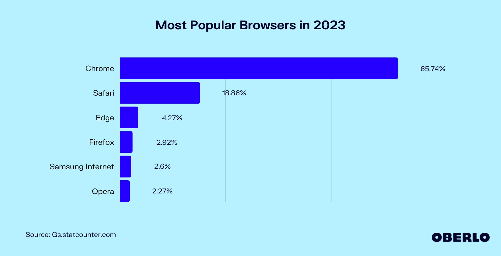

---

# Implementacje WebRTC

---

## LibWebRTC

- Implementacja Google używana w Chromium
- Monolit w C++
- De facto standard
- Brak buildów

---

## Pion

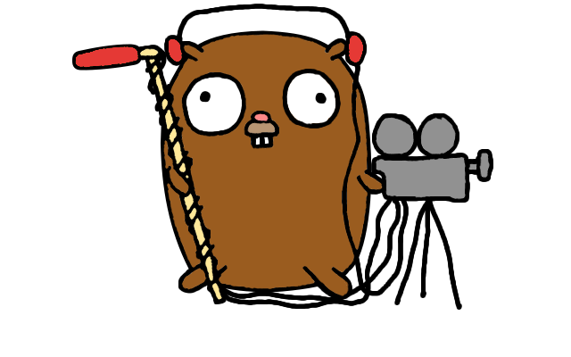

- W całości w Go
- Feature complete
- Czytelny kod
- Community
- [github.com/pion/webrtc](https://github.com/pion/webrtc)

---

# Serwery

---

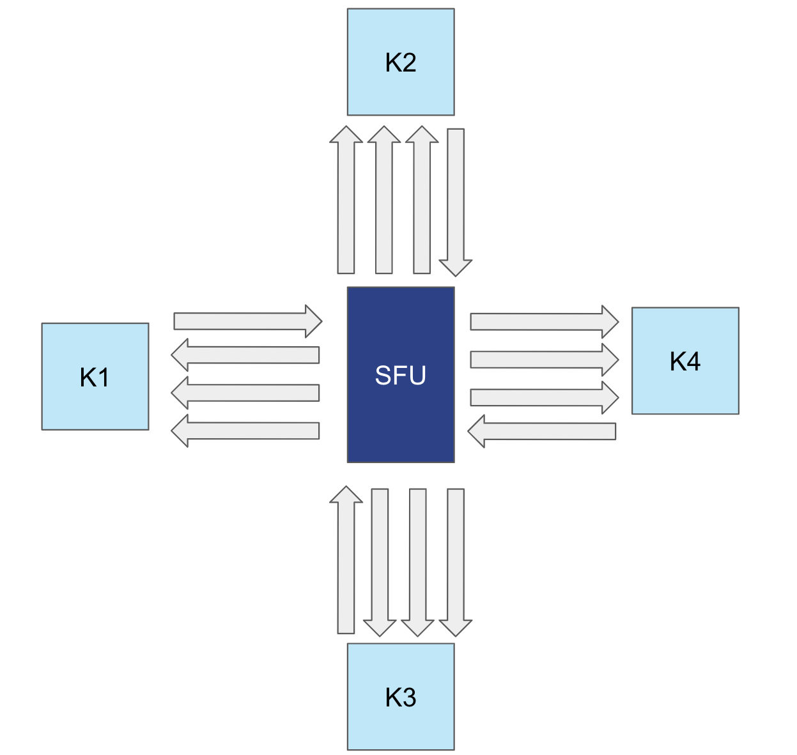
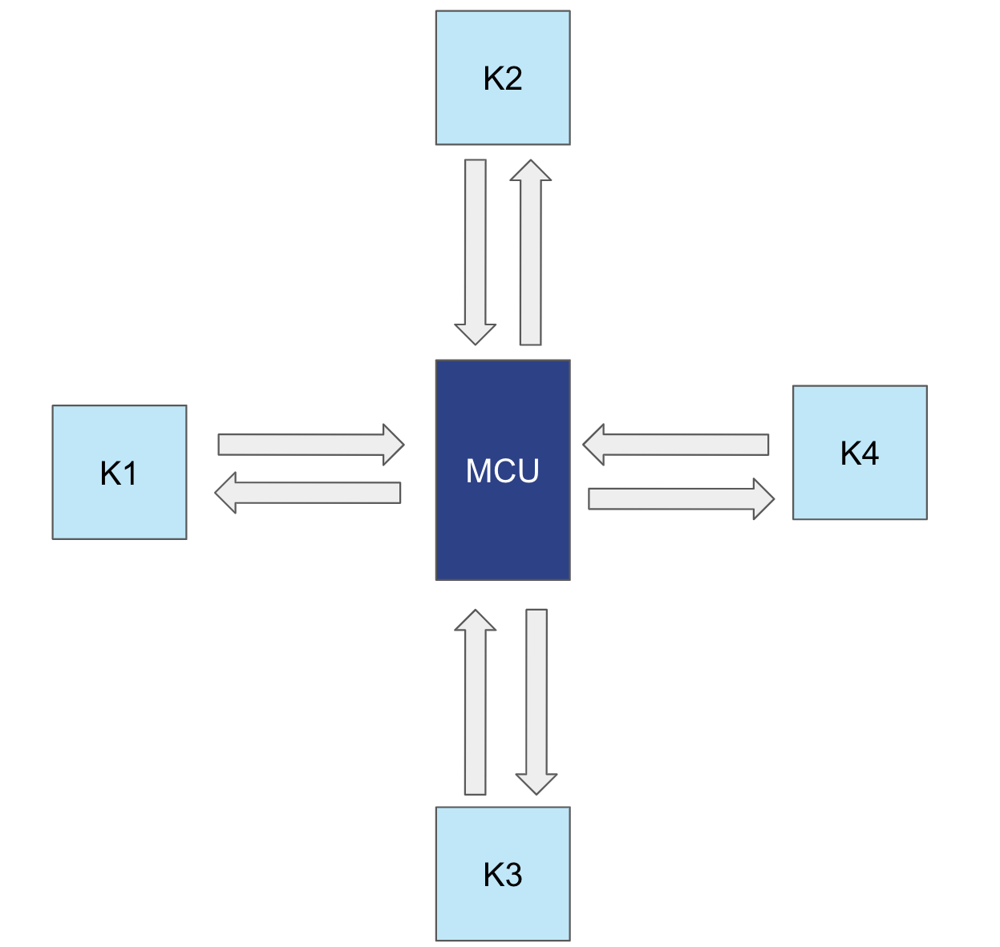

---

## LiveKit


- Sensowne API
- Wiele SDK
- Optymalizacje E2E (demo)
- Distributed (cloud)
- Czytelny kod
- [livekit.io](https://livekit.io/)

---

## Jitsi


- W Javie
- W założeniu łatwy w użyciu
- Ograniczone możliwości konfiguracji/interakcji
- [Jitsi meet](https://meet.jit.si)
- [jitsi.org](https://jitsi.org)

---

## Janus


- W C
- Pierwsza popularna implementacja WebRTC
- Konfigurowalny
- Niska jakość kodu
- Niepraktyczne API
- GPL
- [github.com/meetecho/janus-gateway](https://github.com/meetecho/janus-gateway)

---

## MediaSoup

- Node, C++
- Kiedyś rozbudowany media serwer
- Dosyć popularny

---

## Jellyfish


- W Elixirze
- Integruje WebRTC z innymi protokołami
- Rozszerzalny
- Oparty o Membrane
- [membrane.stream](https://membrane.stream/)

---

## Wydajność

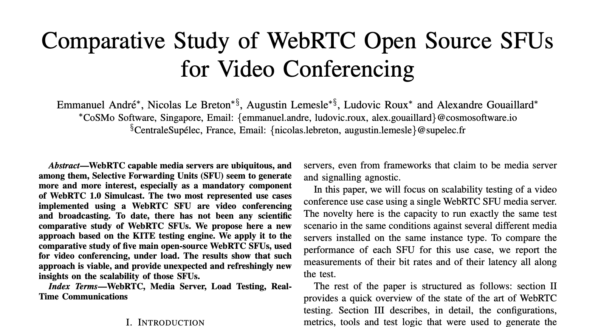
<br>
<br>
<br>
<br>
<br>
https://mediasoup.org/resources/CoSMo_ComparativeStudyOfWebrtcOpenSourceSfusForVideoConferencing.pdf

---

## SaaS

- Mux
- Agora
- Livekit
- 8x8 (Jitsi)
- AWS Chime
- Cloudflare

---

## Broadcasting

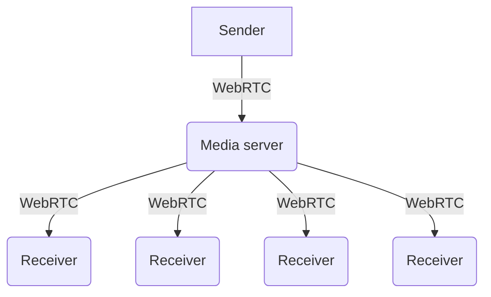

---

## Broadcasting

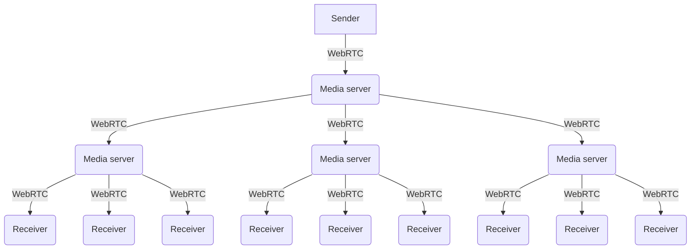

---

# Jakie są inne opcje?

---

## Problemy WebRTC

- Wymusza niską latencję
- Wymaga użycia (zbyt?) wielu protokołów
- Wymaga użycia nieadekwatnych protokołów (SDP, JSEP)
- Bałagan w RTP extensions
- Nieustandaryzowany signaling
- Nieustandaryzowane kluczowe funkcjonalności (congestion control)
- libwebrtc jest de facto standardem

---

## Low latency streaming

- ORTC
- QUIC

---

## ORTC

- Określane WebRTC 1.1
- Nie wymusza SDP/JSEP
- ~2016 [*]

---

## QUIC

- Warstwa IV, enkapsulowany w UDP
- Zaimplementowany w Chromium
- Działa na nim HTTP/3
- WebTransport
- Stream API i datagram API
- Konfigurowalna kontrola przeciążeń

---

## QUIC Stream API

- Niezawodne
- Uporządkowane
- Podlega kontroli przeciążeń

---

## QUIC Stream API

<br/><br/>

```mermaid
gantt
      title TCP
      dateFormat ss
      axisFormat %S
      Section Stream
      A1 :1a, 0, 10s
      A2 :1b, after 1a, 5s
      A3 :1c, after 1b, 10s
      B1 :2a, after 1c, 5s
      B2 :2b, after 2a, 10s
      B3 :2c, after 2b, 5s
```

```mermaid
gantt
      title QUIC
      dateFormat ss
      axisFormat %S
      Section Stream A
      1 :1a, 0, 10s
      2 :1b, after 1a, 5s
      3 :1c, after 1b, 10s
      dateFormat ss
      axisFormat %S
      Section StreamB
      1 :2a, 0, 5s
      2 :2b, after 2a, 10s
      3 :2c, after 2b, 5s
```

---

## QUIC Datagram API

- Zawodne
- Nieuporządkowane
- Podlega kontroli przeciążeń

---

## QUIC

```mermaid
gantt
      title QUIC
      dateFormat ss
      axisFormat %S
      Section Stream A
      1 :1a, 0, 10s
      2 :1b, after 1a, 5s
      3 :1c, after 1b, 10s
      dateFormat ss
      axisFormat %S
      Section StreamB
      1 :2a, 0, 5s
      2 :2b, after 2a, 10s
      3 :2c, after 2b, 5s
      Section Datagrams
      1 :3a, 0, 10s
      2 :3b, 0, 15s
      3 :3c, 0, 5s
```

---

## Media over QUIC

- Uniwersalny protokół
- Problemy z kontrolą przeciążeń
- Problem ze sterowaniem enkoderem - WebCodecs

---

## Low latency streaming

- ni ma ¯\\\_(ツ)\_/¯


---

## Broadcasting

- WHIP & WHEP
- RTMP & HLS
- RUSH & WARP

---

## WHIP & WHEP

- Standaryzują signaling dla WebRTC
- WHIP ingres, WHEP egres
- Komunikacja między serwerami
- Mało elastyczne

---


## Broadcasting

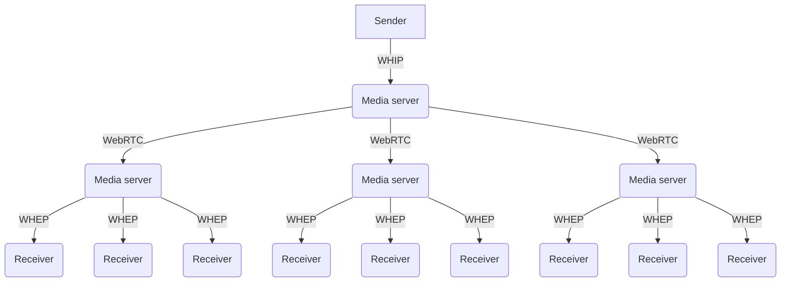

---

## RTMP & HLS

- Standardowy stack
- Działa na TCP
- RTMP
  - popularny, ale porzucony
  - jest
  - SRT & RIST
- HLS
  - dzieli stream na krótkie fragmenty
  - zapisuje je do plików i udostępnia po HTTP

---

## Broadcasting

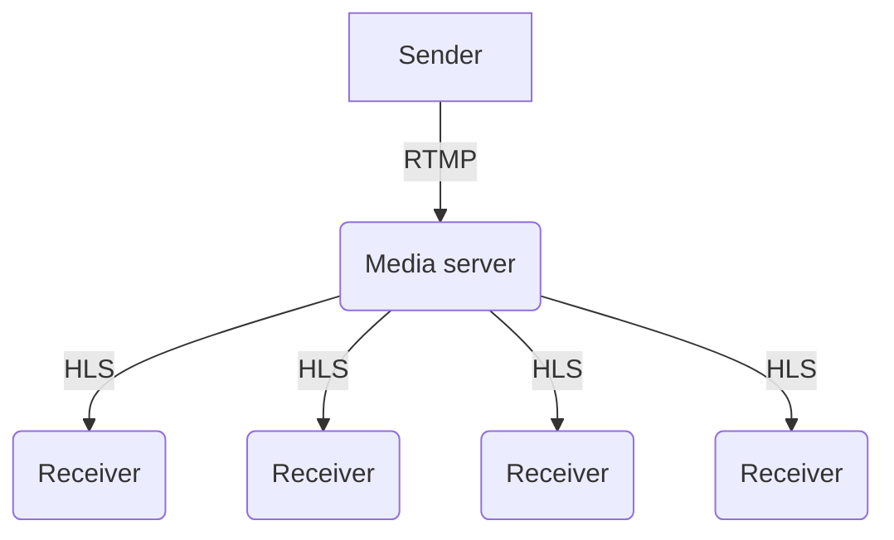

---

## Broadcasting

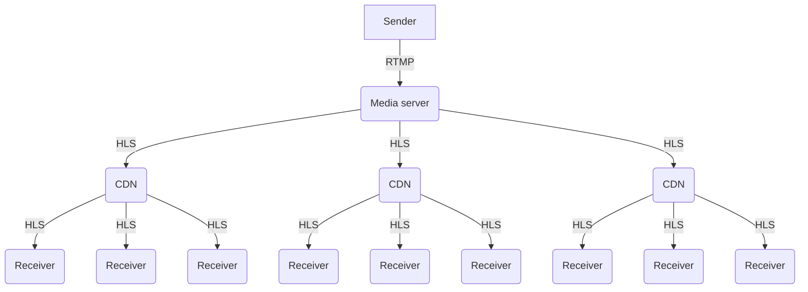

---

## RUSH & WARP

- Problemy z jakością WebRTC
- Oparte o QUIC streams
- RUSH - Meta, WARP - Twitch

---

## RUSH & WARP

<br/><br/>

```mermaid
gantt
      title HLS
      dateFormat ss
      axisFormat %S
      Section Stream
      V1 :1a, 0, 10s
      A1 :1b, after 1a, 5s
      V2 :1c, after 1b, 5s
      A2 :2a, after 1c, 10s
      V3 :2b, after 2a, 10s
      A3 :2c, after 2b, 5s
```

```mermaid
gantt
      title WARP
      dateFormat ss
      axisFormat %S
      Section StreamA
      A1 :2a, 0, 5s
      A2 :2b, after 2a, 10s
      A3 :2c, after 2b, 5s
      dateFormat ss
      axisFormat %S
      Section StreamB
      V1 :1a, 0, 10s
      V2 :1b, after 1a, 5s
      V3 :1c, after 1b, 10s
```

---

## Broadcasting

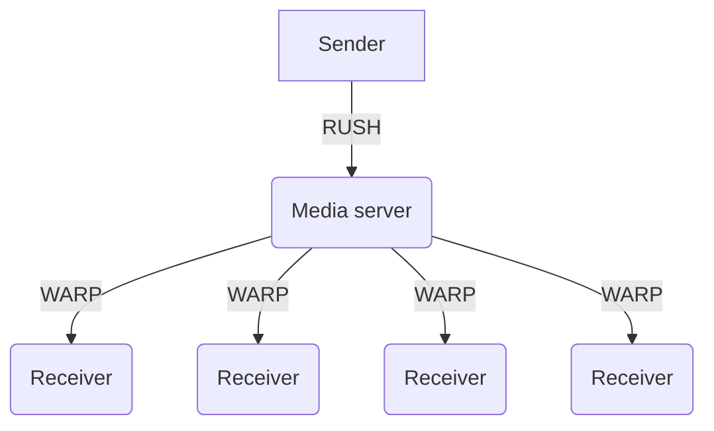

---

## Broadcasting

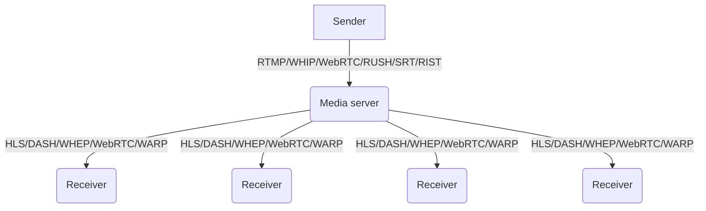

---

## Jak to jest pracować w multimediach?

---

## Jak to jest pracować w multimediach?


---

# internship.swmansion.com

---

# Pytania?

---

## Linki

- https://webrtc.github.io/samples/
- https://www.chromium.org/quic/
- https://atscaleconference.com/videos/live-media-over-quic/
- https://bloggeek.me/whip-whep-webrtc-live-streaming/
- https://developer.mozilla.org/en-US/docs/Web/API/WebCodecs_API
- https://github.com/pion/webrtc
- https://webrtc.googlesource.com/src

---

## Linki c.d.

- https://livekit.io
- https://meet.jit.si
- https://jitsi.org
- https://github.com/meetecho/janus-gateway
- https://mediasoup.org
- https://membrane.stream
- https://mediasoup.org/resources/CoSMo_ComparativeStudyOfWebrtcOpenSourceSfusForVideoConferencing.pdf
- https://ortc.org/